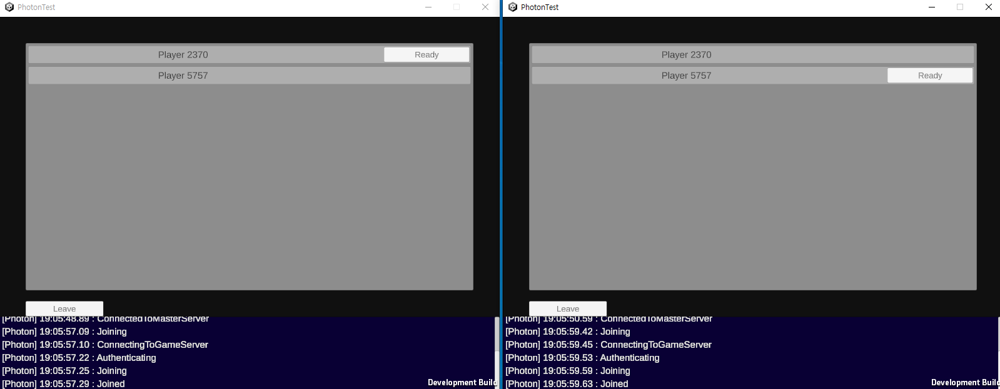

# Photon Room Matching Test 

This Project is Simple Photon PUN2 Network Test Project

if you wnat PUN2 detailed Manual check the link below

https://doc.photonengine.com/pun/current/demos-and-tutorials/pun-basics-tutorial/intro

# Defendency 

You need Photon  PUN2 Cloud Setup (need App ID)

and you need to Setup PUN2 - free Asset

(https://assetstore.unity.com/packages/tools/network/pun-2-free-119922)

# Simple ScreenShot

# Simple features

1. Login
    - just ID Check
2. Lobby
   - Create Room Or Join Room Or Random Matching
3. In Room
     - check Ready and go Game

